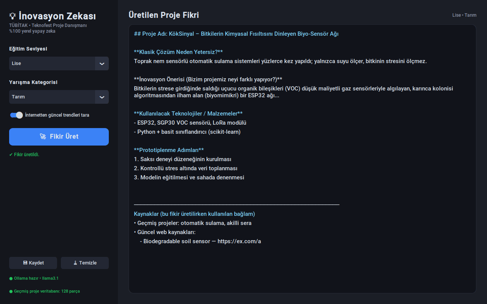

# 💡 TÜBİTAK / Teknofest İnovasyon Zekası

Seçilen **eğitim seviyesi** ve **yarışma kategorisine** göre, geçmiş projeleri (yerel RAG) ve
internetteki güncel teknoloji trendlerini harmanlayıp **daha önce yapılmamış, prototiplenebilir**
proje fikirleri üreten masaüstü uygulaması. LLM ve vektör veritabanı **tamamen bilgisayarınızda** çalışır.



## Mimari

| Dosya | Görev |
|---|---|
| `main.py` | CustomTkinter koyu temalı arayüz (arka plan thread'i + canlı akış) |
| `ai_engine.py` | LangChain + Ollama; RAG ve web bağlamını sistem promptuna gömer |
| `search_module.py` | DuckDuckGo (API anahtarsız) ile son 1 yılın trendlerini toplar ve özetler |
| `database_builder.py` | `gecmis_projeler/` içindeki PDF/TXT/MD/DOCX dosyalarını parçalayıp ChromaDB'ye yazar |
| `config.py` | Model adları, yollar, kategoriler ve limitler (tek yerden ayar) |

Akış: **ChromaDB'den geçmiş projeler (Context 1)** → **DuckDuckGo'dan güncel haberler (Context 2)** → **Ollama**.

## Kurulum

1. [Ollama](https://ollama.com)'yı kurun ve modelleri indirin:
   ```bash
   ollama pull llama3.1          # veya: ollama pull gemma2
   ollama pull nomic-embed-text  # geçmiş projeler (RAG) için embedding modeli
   ```
2. Python 3.10+ ile bağımlılıkları kurun (Linux'ta ayrıca `sudo apt install python3-tk`):
   ```bash
   python -m venv .venv
   source .venv/bin/activate      # Windows: .venv\Scripts\activate
   pip install -r requirements.txt
   ```
3. Geçmiş proje raporlarını `gecmis_projeler/` klasörüne koyup veritabanını oluşturun
   (yeni dosya ekledikçe tekrar çalıştırın; eklenmiş dosyalar atlanır):
   ```bash
   python database_builder.py          # --reset ile sıfırdan kurar
   ```
4. Uygulamayı başlatın:
   ```bash
   python main.py
   ```

Veritabanı boş olsa da uygulama çalışır; bu durumda model klasik projeleri kendi bilgisinden eler.

## Ayarlar

Kod değiştirmeden ortam değişkenleriyle:

```bash
INOVASYON_LLM_MODEL=gemma2 python main.py
INOVASYON_TEMPERATURE=0.9 INOVASYON_NUM_CTX=16384 python main.py
```

Kategoriler ve limitler `config.py` içindedir.

## Gizlilik

- LLM, embedding ve ChromaDB yerel çalışır; ChromaDB telemetrisi ve LangSmith izleme kodda kapatılmıştır.
- İnternete giden **tek** şey, web araması açıksa DuckDuckGo'ya gönderilen kategori sorgusudur
  (ör. *"agriculture agritech smart farming innovation breakthrough"*). Raporlarınız veya üretilen
  fikirler dışarı gönderilmez. Arayüzdeki anahtarla web araması tamamen kapatılabilir.

---

## 🚗 Ek proje: Fiyat-Performans Araç Öneri ve Analiz

Bütçeye göre ikinci el araç ilanlarını toplayıp Claude ile analiz eden Streamlit uygulaması
[`arac_analiz/`](arac_analiz/) klasöründedir. Kurulum ve kullanım için [arac_analiz/README.md](arac_analiz/README.md).
